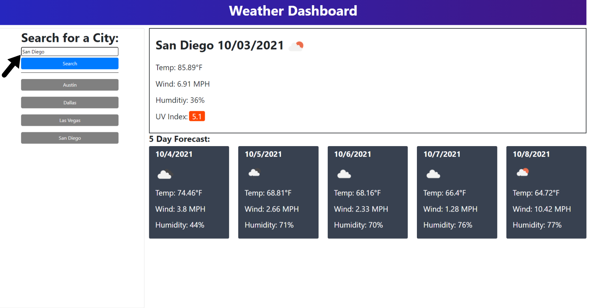
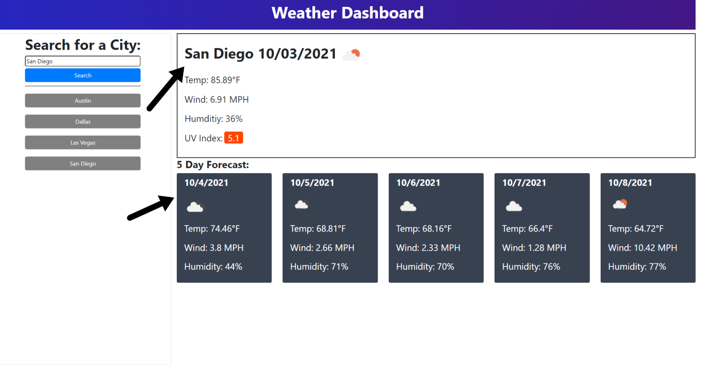
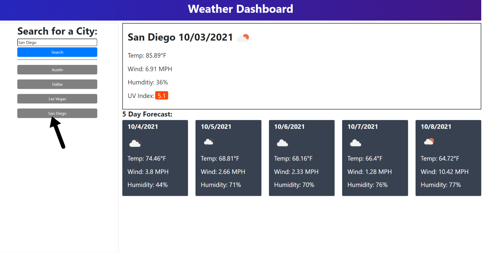

# Homework-6-Weather-Checker

## Languages Used
HTML CSS Javascript

## Description
This is a simple weather app that gives you the current weather, and a five day future forecast for the city you searched for. It features dynamically generated HTML elements in regards to the five day forecast data as well as the search history. The search history will stay on the page even on page refresh and load if there is any history to be loaded.
<br><br>

## User Story
```md
GIVEN a weather dashboard with form inputs
WHEN I search for a city
THEN I am presented with current and future conditions for that city and that city is added to the search history
WHEN I view current weather conditions for that city
THEN I am presented with the city name, the date, an icon representation of weather conditions, the temperature, the humidity, the wind speed, and the UV index
WHEN I view the UV index
THEN I am presented with a color that indicates whether the conditions are favorable, moderate, or severe
WHEN I view future weather conditions for that city
THEN I am presented with a 5-day forecast that displays the date, an icon representation of weather conditions, the temperature, the wind speed, and the humidity
WHEN I click on a city in the search history
THEN I am again presented with current and future conditions for that city
```

## Usage
Clicking onto the input box will show that you've selected and are active inside of the input box.<br>
<br><br>

After populating the input box with a city name and you click search, it will display the current weather date after clicking search. It will display the weather icons forecasted for that time and date.<br>
<br><br>

After each search, a new button will appear with your latest city search that will give you weather data if the buttons in the search history is clicked on.<br>
<br><br>

## Credits/Contributors
I want to thank Sue Lee for suggesting a solution in regards to trying to format the current date into the correct order as well as iterating over the data of the five day forecast <br><br>
Current Date Code: 
```javascript
 for (i = 5; i < response.list.length; i += 8) {
 }
 ```
 <br><br>
 Five Day Forecast:
 ```javascript
 dateEl.text(moment(response.list[i].dt_txt).format('M/D/YYYY'));
 ```
 <br><br>
I also want to thank Todd Taylor for helping me in finding a way to get the icon code from the API and use it to generate an img. He also helped find a way to print a degree symbol into a string.
<br><br>
 ```javascript
 let iconEl = $("");
            iconEl.attr("class", "futureIcon");
            let iconCode = response.list[i].weather[0].icon;
            let iconUrl = `http://openweathermap.org/img/wn/${iconCode}@2x.png`;
            iconEl.attr("src", iconUrl);
```
```javascript
let tempEl = $("<li>");
tempEl.text("Temp: " + response.list[i].main.temp + String.fromCharCode(176) + "F"); 
```
<br><br>

## Problems
Some problems I ran into in developing this application was making sure I was able to do all of my functionality while the variables were in scope. A very tedious thing, as I learned that most people do this for API calls, was just trying to get the correct data out off the API. I also had issues in figuring out how the page layout would be including the elements that would be generated dynamically in javascript. 

## Future Development
I've acknowledged that I've hard coded the search to be based on the time of search, thus resulting in the future five day forecast to not always give you data on the midday forecast for the future days rather it will give you the forecast at whatever is at a certain position in the array given by the API. I will tackle the math in converting the loop to always pick the midday forecast no matter the time of search. Another bug is that the search history generated will only take what the user inputs, so if the user puts in the city name all lowercase, then the history will generate a button with the same text making it look unprofessional.<br><br>

## Built Using
Bootstrap 4.6: [Bootstrap](https://getbootstrap.com/docs/4.6/getting-started/introduction/)<br><br>
Moment.js: [moment.js](https://momentjs.com/docs/)<br><br>
jQuery 3.6: [jQuery](https://code.jquery.com/)<br><br>

## APIs used
One Call API: [One Call](https://openweathermap.org/api/one-call-api)<br><br>
Current Weather Data API: [Current Weather](https://openweathermap.org/current)<br><br>
Five Day Forecast API: [Five Day Forecast](https://openweathermap.org/forecast5)<br><br>